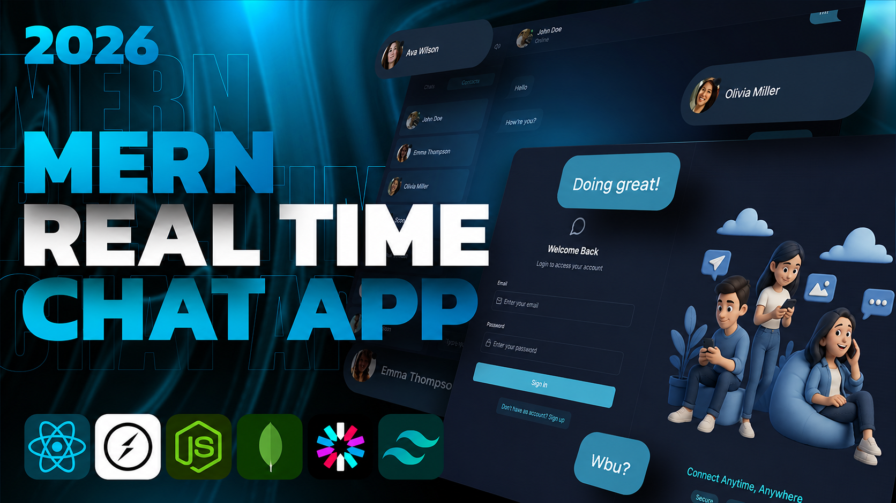

# 💬 Chatify – Full-Stack Real-Time Chat Application

<p align="center">
  
</p>

<p align="center">
  
  
  
  
  
  
  
  
  
</p>

<p align="center">
A modern, secure and responsive real-time chat application built using the MERN Stack with JWT Authentication, Socket.IO, Cloudinary image uploads and email verification.
</p>

---

# ✨ Features

### 🔐 Authentication & Security

- Custom JWT Authentication
- Password Hashing using bcrypt
- Protected Routes
- Secure HTTP-only Cookies
- API Rate Limiting using Arcjet
- Environment Variable Protection

---

### 💬 Real-Time Messaging

- Instant Messaging
- Socket.IO Integration
- Online / Offline Status
- Auto Message Updates
- Typing & Notification Sounds
- Sound Toggle Option

---

### 📷 Media Support

- Upload Profile Pictures
- Cloudinary Image Storage
- Fast Image Delivery

---

### 📧 Email Integration

- Welcome Email after Signup
- Professional HTML Email Templates
- Resend Email API Integration

---

### 🎨 Modern UI

- Fully Responsive Design
- Tailwind CSS
- DaisyUI Components
- Dark Theme
- Beautiful Chat Interface
- Smooth User Experience

---

### ⚙️ Backend

- RESTful API
- Express.js
- MongoDB & Mongoose
- JWT Authentication
- Cookie Parser
- Error Handling Middleware

---

# 🛠 Tech Stack

| Frontend | Backend | Database | Services |
|-----------|----------|-----------|-----------|
| React.js | Node.js | MongoDB | Cloudinary |
| Tailwind CSS | Express.js | Mongoose | Resend |
| DaisyUI | JWT | | Arcjet |
| Zustand | Socket.IO | | |

---

# 📂 Folder Structure

```
Chatify/
│
├── frontend/
│   ├── public/
│   ├── src/
│   └── package.json
│
├── backend/
│   ├── controllers/
│   ├── middleware/
│   ├── models/
│   ├── routes/
│   ├── lib/
│   ├── config/
│   └── package.json
│
└── README.md
```

---

# ⚙️ Environment Variables

## Backend (`backend/.env`)

```env
PORT=3000

MONGO_URI=your_mongodb_connection

NODE_ENV=development

JWT_SECRET=your_jwt_secret

CLIENT_URL=http://localhost:5173

RESEND_API_KEY=your_resend_api_key
EMAIL_FROM=your_email
EMAIL_FROM_NAME=your_name

CLOUDINARY_CLOUD_NAME=your_cloud_name
CLOUDINARY_API_KEY=your_api_key
CLOUDINARY_API_SECRET=your_api_secret

ARCJET_KEY=your_arcjet_key
ARCJET_ENV=development
```

---

# 🚀 Installation

Clone the repository

```bash
git clone https://github.com/bs-bhaskar/chatify.git
```

Move into project folder

```bash
cd chatify
```

---

## Backend

```bash
cd backend
npm install
npm run dev
```

---

## Frontend

```bash
cd frontend
npm install
npm run dev
```

---

# 📸 Map

  


---

# 🚀 Deployment

Frontend

- Vercel / Netlify

Backend

- Render / Railway / Sevalla

Database

- MongoDB Atlas

---

# 🔮 Future Improvements

- Voice Messages
- Video Calling
- Group Chats
- Message Reactions
- Read Receipts
- File Sharing
- Push Notifications
- Message Search

---

# 🤝 Contributing

Contributions are always welcome.

1. Fork the repository
2. Create a new branch

```bash
git checkout -b feature-name
```

3. Commit your changes

```bash
git commit -m "Added new feature"
```

4. Push

```bash
git push origin feature-name
```

5. Create a Pull Request

---

# 👨‍💻 Author

**Bhaskar Yogi**

💼 Full Stack Developer

GitHub: https://github.com/bs-bhaskar

LinkedIn: https://linkedin.com/in/yourusername

---

# ⭐ Support

If you like this project, don't forget to ⭐ the repository.

It motivates me to build more awesome projects.

---

<p align="center">
Made with ❤️ using the MERN Stack
</p>